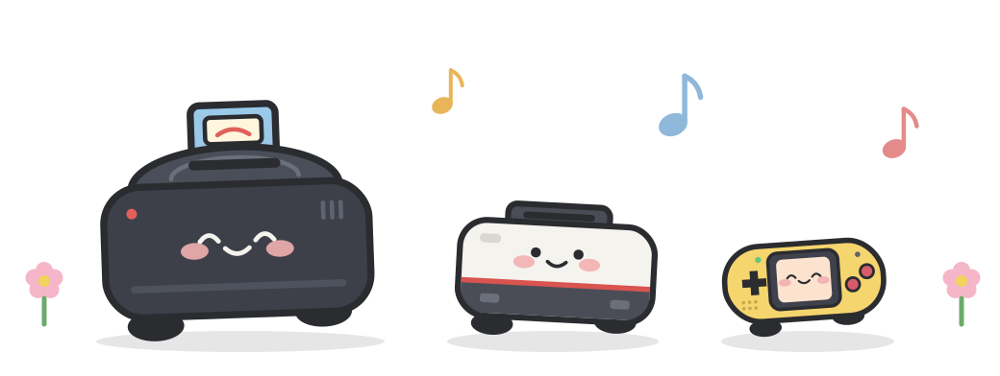
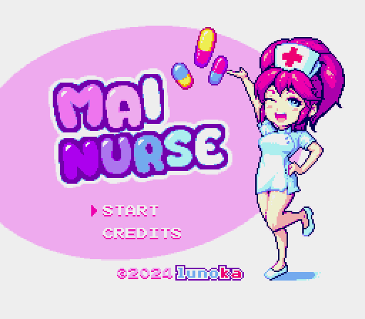
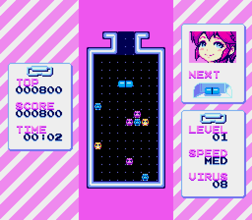
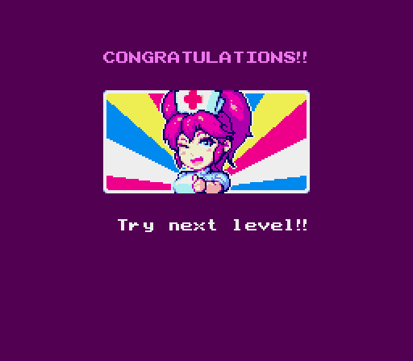
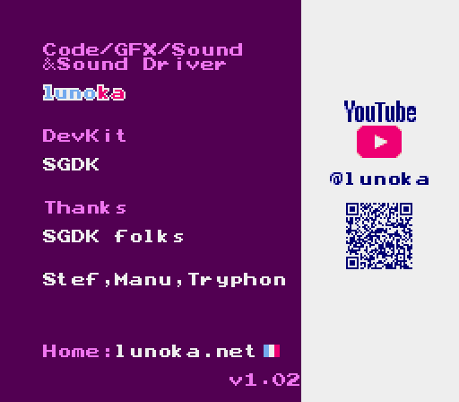

  

<h1 align="center">PopSG</h1>

  
  

  
  
   
  
  

画面は lunoka 氏の <a href="https://lunoka.itch.io/mai-nurse">「Mai Nurse」</a> を PopSG の x1(等倍)表示で動かしたものです(作者の許可を得て掲載。下の「クレジット」を参照)。

**非公式・非商用の改変版です。** PopSG は、セガのゲーム機のエミュレータ [PicoDrive](https://github.com/irixxxx/picodrive)(notaz 氏、irixxxx 氏ほか)の libretro 版を、SHARP の電子辞書 Brain PW-G5200(Windows CE)向けに移植した**非公式**の改変版です。PicoDrive の公式版ではありません。PicoDrive の作者やメンテナーはこの移植に関わっておらず、サポートもしていません。不具合の報告は、上流ではなくこちらにお願いします。PicoDrive のライセンスにより、販売すること、商用の製品や活動に使うこと、お金を払った人だけに配ることはできません。

**Unofficial, non-commercial port.** PopSG is an unofficial port of the libretro edition of PicoDrive (by notaz, irixxxx and contributors) to the SHARP Brain PW-G5200 (Windows CE). It is not an official PicoDrive release, and the PicoDrive authors and maintainers are not involved in it and do not support it. Please report PopSG issues here, not upstream. Under the PicoDrive license, PopSG may not be sold or used in a commercial product or activity.

## ダウンロード
最新版は Releases のページからダウンロードできます。
https://github.com/daizu-coder/PopSG/releases/latest

## アプリのインストール
Brainへのインストールは[アプリの起動方法](https://brain.fandom.com/ja/wiki/アプリの起動方法)を参照してください。

メガドライブ(`.md`、`.gen`、`.smd`)、マスターシステム(`.sms`)、ゲームギア(`.gg`)のゲームは、そのまま開けます。これらに BIOS は要りません。拡張子が `.bin` のメガドライブのゲームは一覧に出ないので、拡張子を `.md` に変えてください。

メガCD のゲームは、`.cue` と、それに対応する `.bin`(音声トラックの `.bin` も含みます)の組で開きます(`.cue` を選びます)。CHD と、音声トラックが MP3・OGG のものには対応していません。メガCD のゲームは動作が遅くなります。遊ぶには、メガCD の BIOS のイメージが別に必要です。BIOS は同梱していないので、ご自身で用意してください。

- BIOS のファイル名は自由です。拡張子は `.bin` にしてください(128KB)
- `AppMain.exe` と同じフォルダに置いてください。そのフォルダの中だけを探します(サブフォルダは探しません)
- 見つからないときは、メッセージのあとにファイルを選ぶ画面が出るので、BIOS を選んでください。選んだフォルダは覚えていて、次からは最初にそこを探します
- BIOS かどうかは中身で見分けるので、ほかのファイルと同じフォルダに置いても大丈夫です
- ゲームと同じ地域(日本・北米・欧州)の BIOS が必要です

ファイルを選ぶ画面には `.zip` と `.iso` も出ますが、動作は確かめていません。この端末の CPU では負担が大きいため、今はおすすめしません。

## 制作について
コードとマスコットの絵はAI(Claude)で作りました。製作者はプログラムを読めません。

## ライセンスと商標
PopSG 全体は、上流と同じ条件(PicoDrive の非商用ライセンス)で配布します。PopSG の自作部分は MIT ライセンス、マスコットの絵とアイコンは CC0 1.0 です。上流はいくつもの部品からできていて、部品ごとにライセンスの条件が異なるため(Genesis Plus GX から来た非商用のライセンスのファイル、GPL と選べるファイル、表記のないファイルがあります)、詳しくは [CE/LICENSING.md](../CE/LICENSING.md) をご覧ください。

「SEGA」「セガ」「メガドライブ」「Mega Drive」「Genesis」「マスターシステム」「Master System」「ゲームギア」「Game Gear」「メガCD」「Mega-CD」「Sega CD」は株式会社セガの商標、「SHARP」「Brain」はシャープ株式会社の商標です。PopSG は、セガ、シャープなどの権利者とは関係ありません。

ゲームの ROM と BIOS は同梱していません。

ソースを取得するときは `git clone --recursive` を使ってください。サブモジュール(Cyclone 68000、emu2413)を使っているので、`--recursive` なしのクローンや「Download ZIP」ではビルドできません。

**使い方やビルドの説明は [CE/README.md](../CE/README.md)、ライセンスの詳しい説明は [CE/LICENSING.md](../CE/LICENSING.md) にあります。**

このリポジトリは、上流の [libretro/picodrive](https://github.com/libretro/picodrive) のコミット `6248b51` を元にしています。直下の `README.md` は上流の PicoDrive の説明で、PopSG の説明ではありません。

## クレジット

PopSG は、次の方々の作品を使わせていただいています。ありがとうございます。

- **PicoDrive**(エミュレータ本体):notaz 氏(Gražvydas Ignotas 氏)、irixxxx 氏ほか、PicoDrive のコントリビューターと、libretro 版を保守する libretro のコントリビューター。PicoDrive のライセンス(非商用)。上流は [libretro/picodrive](https://github.com/libretro/picodrive)、[irixxxx/picodrive](https://github.com/irixxxx/picodrive) です。
- **Cyclone 68000**(68000 CPU):FinalDave 氏、notaz 氏。GPL バージョン2と MAME のライセンスから選べます(PopSG は MAME のライセンスを選んでいます)。
- **DrZ80**(Z80 CPU):Reesy 氏、irixxxx 氏。非商用なら無料。
- **メガCD の CD コントローラ・CD ドライブ・グラフィック回路、SPI の EEPROM**:Eke-Eke 氏(Genesis Plus GX)。非商用のライセンス。
- **SVP(バーチャレーシングのチップ)**:notaz 氏。BSD 3条項ライセンス。
- **YM2612 音源**:Jarek Burczynski 氏、Tatsuyuki Satoh 氏(MAME の fm.c)。**SN76489 音源**:MAME の sn76496.c。
- **emu2413**(YM2413 音源):Mitsutaka Okazaki 氏。MIT ライセンス。
- **音声のリサンプラーのフィルタ**:Hans-Kristian Arntzen 氏(blipper)。MIT ライセンス。
- **libretro API のヘッダ、libretro-common の一部**:The RetroArch team。MIT ライセンス。
- **zlib**:Jean-loup Gailly 氏、Mark Adler 氏。zlib ライセンス。
- **東雲フォント(16ドット)**(画面の文字):古川泰之氏ほか、/efont/(電子書体オープンラボ)。実質パブリックドメイン。
- **Galmuri フォント**(画面の文字):Lee Minseo 氏([quiple/galmuri](https://github.com/quiple/galmuri))。SIL Open Font License 1.1。
- **マスコットの絵とアイコン**:Pop シリーズのマスコットをもとに、AI(Claude)で作りました。CC0 1.0(パブリックドメイン)。
- **スクリーンショットのゲーム**:[「Mai Nurse（Mega Drive 版）」](https://lunoka.itch.io/mai-nurse)、作者は lunoka 氏です。作者の許可を得て、この README に掲載しています。スクリーンショットの画像(`.github/screenshots/`)は、このリポジトリのライセンス(PicoDrive のライセンス、MIT、CC0 1.0)の対象外で、ゲームの著作権は作者にあります。

それぞれの著作権表示とライセンスの全文は [CE/THIRDPARTY_LICENSES.txt](../CE/THIRDPARTY_LICENSES.txt) にあります。
